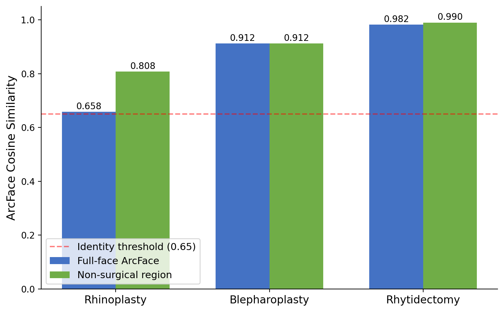
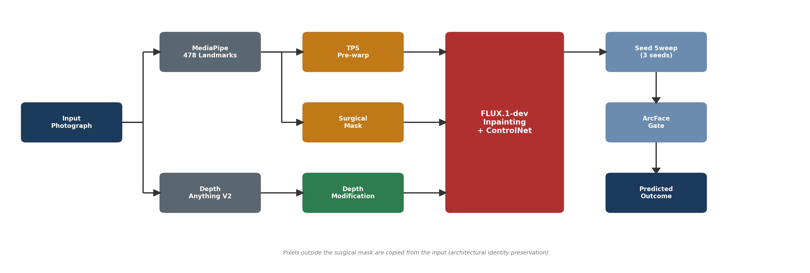
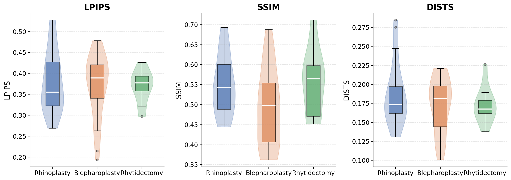
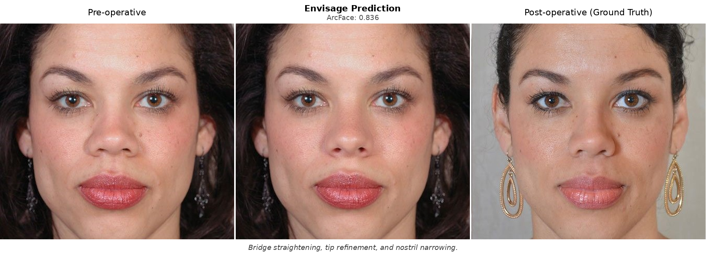

# Envisage

**Diffusion-Based Rhinoplasty Goal Visualization with Mask-Decomposed Evaluation**

[](#citation)
[](LICENSE)

*Mudit Agarwal · Amit Bhrany (University of Washington)*

---

## What is this?

Envisage is a FLUX.1-Fill inpainting pipeline for rhinoplasty goal visualization from a single frontal photograph. You give it a pre-operative photo; it returns a plausible visualization of a surgical outcome, conditioned on one of 24 anatomically-grounded presets (8 rhinoplasty, 8 blepharoplasty, 8 rhytidectomy).

The paper's primary contribution is not the pipeline itself — it is **SurgicalScore**, a mask-decomposed evaluation protocol that fixes a structural confound in how prior work measured success.

---

## The Problem

Full-face identity metrics (ArcFace, SSIM) are structurally confounded under hard-mask compositing. When you copy outside-mask pixels exactly — which any compositing-based pipeline does — the full-face paired score is dominated by those copied pixels, not by what happened inside the surgical region. This makes all compositing pipelines look artificially good on standard metrics.

We show this is not a modeling win: **every method, including ours, produces a negative paired ArcFace gain** (output-to-GT minus input-to-GT). Envisage's gap (−0.048) is the smallest, but all methods move identity *away* from the post-operative ground truth on this metric. The metric is confounded.

---

## The Solution: SurgicalScore

SurgicalScore decomposes evaluation into region-specific components that measure what actually matters for a localized surgical edit:

| Component | Weight | What it measures |
|-----------|:------:|-----------------|
| **A** — Edit direction | 0.40 | Directional alignment of the output displacement toward GT |
| **B** — Edit magnitude | 0.30 | Magnitude match of the surgical deformation |
| **C** — Masked LPIPS  | 0.15 | In-mask reconstruction fidelity vs GT |
| **D** — Realism       | 0.10 | DINOv2-based patch realism in the surgical region |
| **E** — Outside preservation | 0.05 | Outside-mask SSIM (architectural guarantee: >0.999) |

Plus a hard identity gate: ArcFace(input, output) ≥ 0.65.

SS_raw on a perfect-predictor control scores 0.919 [0.918, 0.920], anchoring the empirical ceiling.



---

## Method

The pipeline combines MediaPipe 478-landmark extraction, preset-conditioned TPS geometric deformation, depth-map modification, and FLUX.1-Fill masked inpainting under hard-mask compositing.



Hard-mask compositing copies outside-mask pixels exactly, providing an architectural guarantee of outside-region identity preservation (outside-mask SSIM > 0.999 by construction, not a learned property).

**Candidate generation:**
- **M1** FLUX.1-dev + Depth ControlNet
- **M2** ICEdit-MoE-LoRA (zero-shot baseline)
- **M3** FLUX.1-Kontext-dev (zero-shot baseline)
- **M4** FLUX.1-Fill-dev with surgical masking *(the primary system)*
- **M5** TPS deterministic fallback (zero-hallucination guarantee)

A 7-gate scorer (identity, outside-SSIM, landmark drift, dark-hole, color-shift, bleph-crease, fidelity) selects the best candidate; M5 ships if all diffusion candidates fail.

---

## Key Results

Evaluated on **N=211** rhinoplasty pairs (ASPS public gallery N=202 + private clinical archive N=9), filtered to cases passing MediaPipe detection and same-person ArcFace ≥ 0.65 pre/post.

| Method | N | GT ArcFace | Gap [95% CI] | SurgicalScore |
|--------|:-:|:----------:|:------------:|:-------------:|
| InstructPix2Pix | 208 | 0.417 | −0.294 [−0.331, −0.256] | 0.337 |
| ICEdit | 206 | 0.573 | −0.139 [−0.148, −0.130] | 0.502 |
| FLUX.1-Kontext-dev | 211 | 0.469 | −0.242 [−0.258, −0.225] | 0.229 |
| **Envisage (ours)** | **211** | **0.662** | **−0.048 [−0.055, −0.042]** | **0.599 [0.579, 0.619]** |

All paired comparisons significant at p < 10⁻⁴. External validation on a **457-pair ASPS/PCA corpus** shows a larger negative gap across all methods.

A 5-seed GT-oracle (per-case oracle selection — an upper bound, not a deployable system) reduces the ArcFace gap by 73% (−0.054 → −0.015) on the N=109 five-seed-complete subset; SurgicalScore rises from 0.609 to 0.743 [0.725, 0.762] on the N=207 subset. This indicates candidate-space headroom for a learned ranker.



**Example outputs:**



---

## Repository Structure

```
envisage/                    # Core Python package
├── pipeline_v2.py           # Main pipeline (FLUX + TPS + masking)
├── scorer.py                # 7-gate candidate scorer
├── evaluation.py            # Region-decomposed metrics (older version)
├── rhino_config.py          # Rhinoplasty preset definitions
├── bleph_config.py          # Blepharoplasty preset definitions
├── rhytid_config.py         # Rhytidectomy preset definitions
└── ...                      # Landmarks, masks, depth, TPS, etc.

scripts/
└── burn_preset_ablation.py  # SurgicalScore v5 implementation (paper version)
                             # See _surgicalscore_v5() at line ~231

data/
└── expanded_test_split/
    └── manifest.json        # N=1,109 split manifest (case IDs + ArcFace
                             # pre/post scores; no patient images)

paper/figures/               # Paper figures (pipeline, results, examples)
configs/                     # Model configs (ICEdit, Kontext, rhinoplasty)
24_PRESETS_TAXONOMY.md       # All 24 anatomical presets documented
app.py                       # Gradio demo (http://localhost:7860)
```

**SurgicalScore implementation:** the paper's formula is `_surgicalscore_v5()` in `scripts/burn_preset_ablation.py` (lines ~231–410). The `envisage/evaluation.py` module is an older decomposed-region implementation; use the v5 script for the paper results.

---

## Installation

```bash
git clone https://github.com/dreamlessx/envisage.git
cd envisage

conda create -n envisage python=3.11 -y
conda activate envisage
pip install -r requirements.txt
```

**Requirements:** Python ≥ 3.10, PyTorch ≥ 2.0, CUDA GPU with ≥ 24 GB VRAM (A6000/L40S/A100/H100).

## Quick Start

```python
from envisage.pipeline_v2 import run_pipeline
from envisage.depth import DepthEstimator
import cv2

image = cv2.imread("patient.jpg")
result = run_pipeline(
    pipe,                          # FLUX.1-Fill pipeline (load separately)
    input_bgr=image,
    procedure="rhinoplasty",
    depth_estimator=DepthEstimator(device=0),
)
cv2.imwrite("prediction.jpg", result.prediction)
```

Gradio demo: `python app.py` → `http://localhost:7860`

---

## Data Manifest

`data/expanded_test_split/manifest.json` contains the N=1,109 expanded split across procedures (457 rhinoplasty, 409 rhytidectomy, 243 blepharoplasty), with per-case ArcFace pre/post similarity scores and source labels (ASPS/PCA). No patient images are distributed — case IDs and derived statistics only.

The N=211 headline cohort is rhinoplasty cases passing MediaPipe detection and pre/post ArcFace ≥ 0.65.

---

## Citation

```bibtex
@article{agarwal2026envisage,
  title   = {Envisage: Diffusion-Based Rhinoplasty Goal Visualization
             with Mask-Decomposed Evaluation},
  author  = {Agarwal, Mudit and Bhrany, Amit},
  journal = {arXiv preprint},
  year    = {2026},
  url     = {https://github.com/dreamlessx/envisage}
}
```

---

## Disclaimer

Envisage is a research prototype, not a clinical tool. Outputs are goal-setting visualizations for patient communication, not medical predictions or surgical plans.
